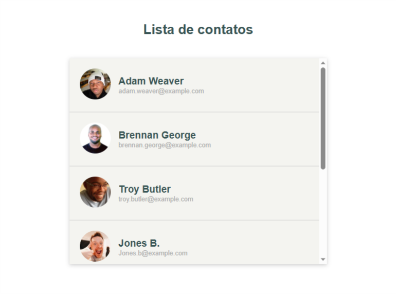
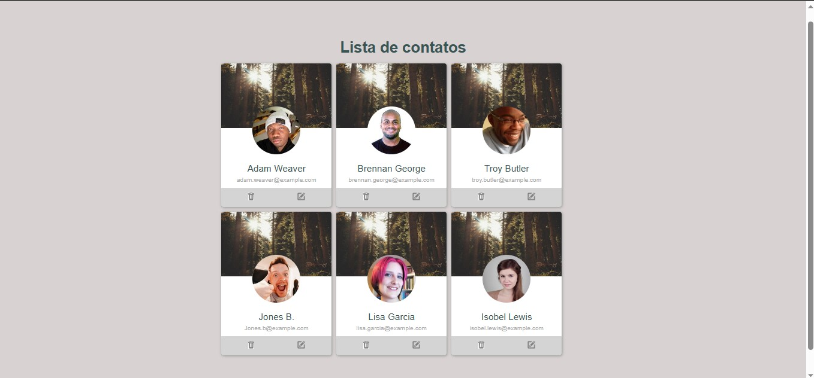

<h1 align="center">
    
</h1>

 

## 📑 Sobre

Neste projeto, o objetivo foi criar uma lista de contatos com HTML e CSS. Usando elementos HTML para estruturar o conteúdo da página e aplicando estilos CSS para personalizar o layout e a aparência. Também foi possível praticar o uso de seletores, propriedades como por exemplo o Display-Flex. O resultado final é uma lista de contatos simples, mas elegante, que poderá ser exibida nos principais navegadores.

 

## 🚀 Tecnologias

◻  
HTML 5

◻ 
Css 3

 
    

## 💻 Layout
 

* Modelo 1

* Modelo 2
