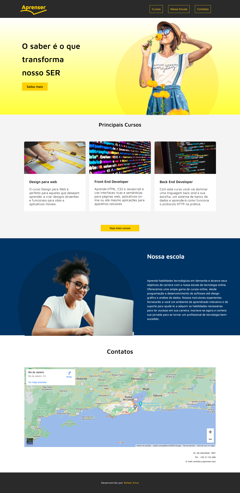

<h1 align="center">
    
</h1>

 

## 📑 Sobre

Neste projeto, o objetivo foi criar uma pagina de uma instituição de ensino com HTML e CSS. Usando elementos HTML para estruturar o conteúdo da página e aplicando estilos CSS para personalizar o layout e a aparência. Também foi possível praticar o uso de seletores, propriedades como por exemplo o Display-Flex, fontes do google e interação com a API do google maps. O resultado final é uma página simples, mas elegante da Aprenser.

 

## 🚀 Tecnologias

◻  
HTML 5

◻ 
Css 3

 
    

## 💻 Layout
 

* Modelo 1

