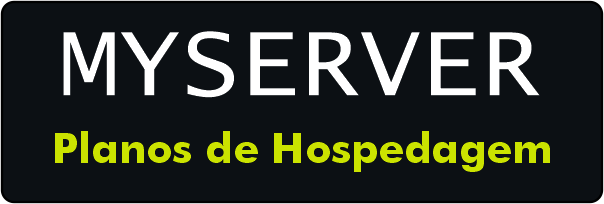
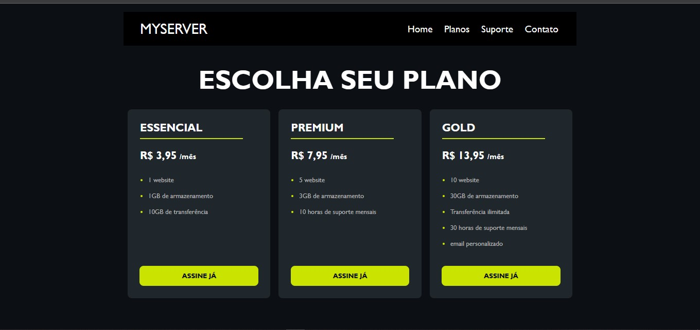

<h1 align="center">
    
</h1>

 

## 📑 Sobre

Este é um projeto feito em HTML e CSS de uma página web onde o cliente podera escolher um planos mensais de acesso a hospedagens de site. O objetivo do projeto foi criar uma interface simples e atraente para os potenciais clientes, usando elementos visuais e textos persuasivos. O projeto foi proposto no curso de web dsigner moderno do prof. Daniel Tapias Morales na platadorma da Udemy.

 

## 🚀 Tecnologias

◻  
HTML 5

◻ 
Css 3

 
    

## 💻 Layout
 

