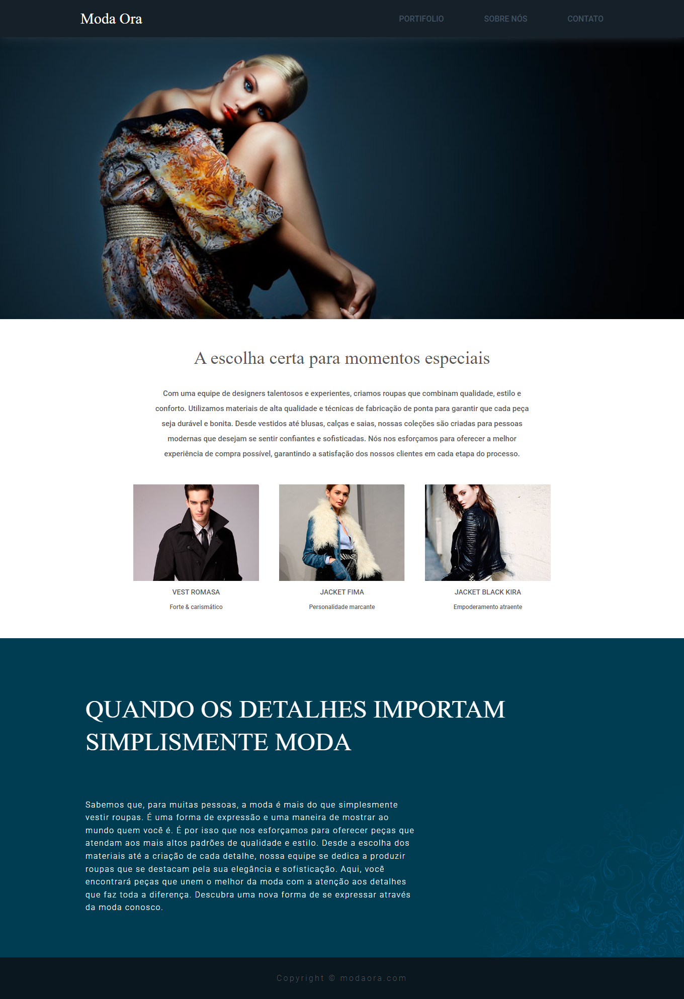

<h1 align="center">
    
</h1>

 

## 📑 Sobre

Este é um projeto de uma página web de moda desenvolvido em CSS e HTML do curso Curso Web Design Completo: HTML5, CSS3 e JS. Neste projeto, o objetivo foi desenvolver um layout  moderno para apresentar uma pagina de moda. Eu gostei muito de fazer este projeto, pois ele me ajudou a praticar as minhas habilidades em CSS e HTML, como por exemplo o conceito de flexbox e importação de fontes externas com do google fontes.

 

## 🚀 Tecnologias

◻  
HTML 5

◻ 
Css 3

 
    

## 💻 Layout
 

